# JSP로 간단한 게시판 CRUD 구현


## 메인화면

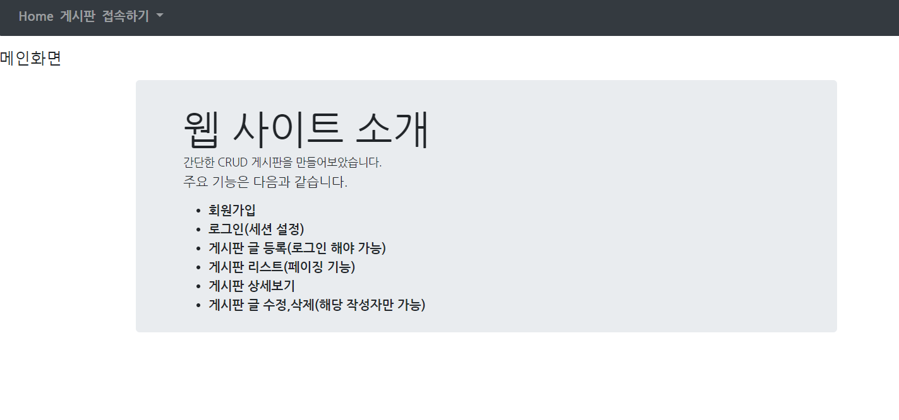


## 회원가입 페이지


회원가입 페이지를 보여주는 join.jsp


회원가입 버튼을 누르면 joinAction.jsp 파일로 이동한다.


-------------------

### joinAction.jsp 수정 전

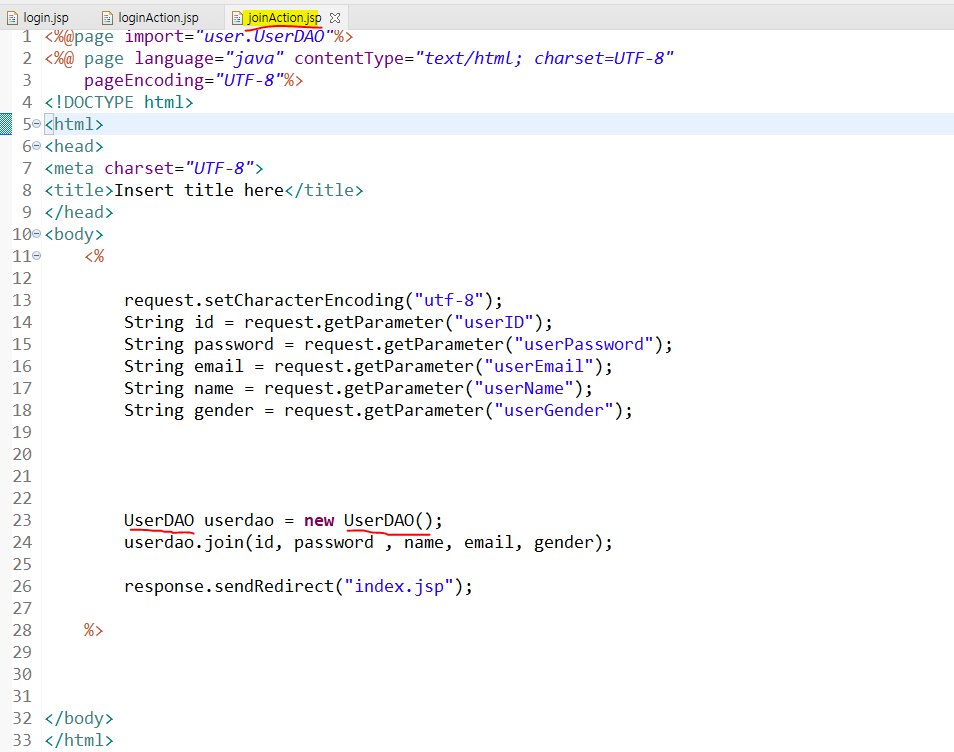


```
 request.getParameter() 을 사용하여 값을 들고온다.
```

들고 온 값을 UserDAO 안에 있는 join 메서드에 넣는다.

-----------------


### joinAction.jsp 수정 후
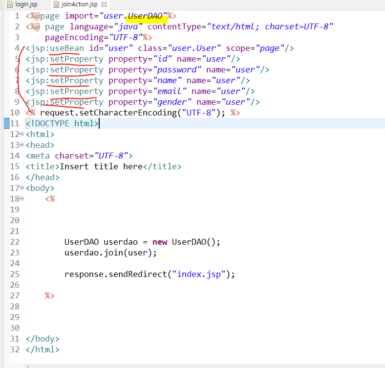

request.getParameter 대신

액션 태그 <jsp:useBean> 과 <jsp:setProperty> 를 사용하였다. 

```
<jsp:useBean id="user" class="user.User" scope="page"/>
id는 자바빈즈를 식별하기 위한 값으로 변수 명은 상관 없다
class에 user 패키지에 User클래스를 사용


```
#### userdao.join 매개변수에는 user 객체를 넣어 전달
-----------------------------
### UserDAO.java 
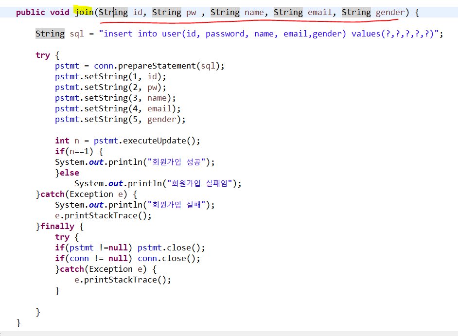

매개변수안에 데이터의 수 만큼 넣어줘야했는데,

<jsp:setProperty> 를 사용하여 매개변수 안에 user 객체를 넣음

```
                user 객체로 받음
public void join(User user) {
		
		String sql = "insert into user(id, password, name, email,gender) values(?,?,?,?,?)";
		
        user 객체 get함수로 값을 넣어줌
		try {
			pstmt = conn.prepareStatement(sql);
			pstmt.setString(1, user.getId());
			pstmt.setString(2, user.getPassword());
			pstmt.setString(3, user.getName());
			pstmt.setString(4, user.getEmail());
			pstmt.setString(5, user.getGender());
			
			int n = pstmt.executeUpdate();
			if(n==1) {
			System.out.println("회원가입 성공");
			}else
				System.out.println("회원가입 실패임");
		}catch(Exception e) {
			System.out.println("회원가입 실패");
			e.printStackTrace();
		}finally {
			try {
			if(pstmt !=null) pstmt.close();
			if(conn != null) conn.close();
			}catch(Exception e) {
				e.printStackTrace();
			}
			
		}
	}
	
}
```

그리고 회원가입 폼 안에있는 
input 태그 안에 name과 , User 클래스 변수명이 같기 때문에

```
<jsp:setProperty property="*" name="user"/>
```
사용 가능


---------------------------------------------------------------------------------
## 로그인 , 세션 설정하기

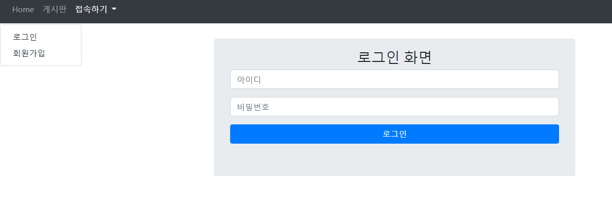


로그인을 하면 세션을 설정해준다.

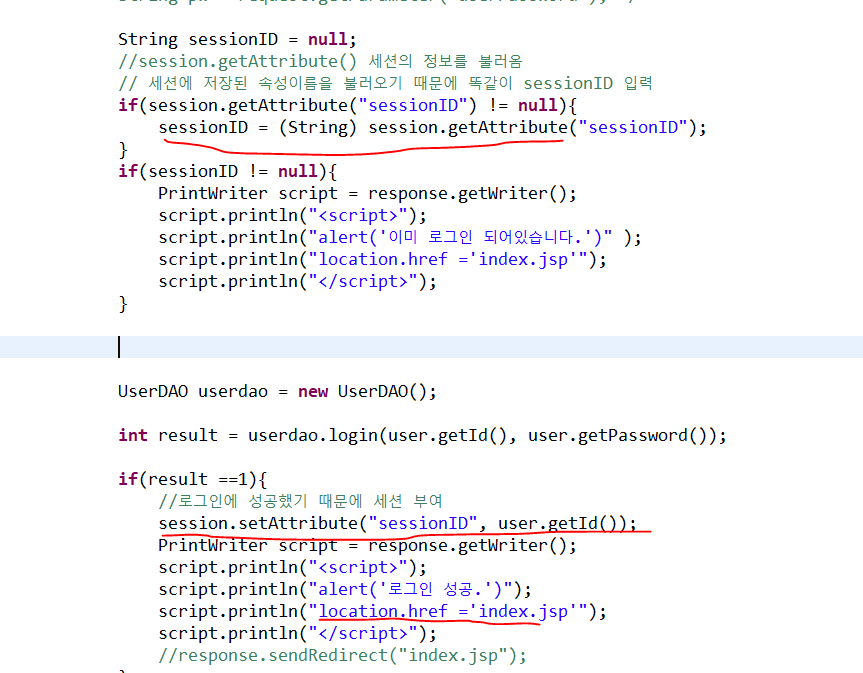

```
session.setAttribute(세션이름 , 세션 값);

session.getAttribute(세션이름);
```

login.jsp -> loginAction.jsp


```
//로그인에 성공했기 때문에 세션 부여
				session.setAttribute("sessionID", user.getId());
				PrintWriter script = response.getWriter();
				script.println("<script>");
				script.println("alert('로그인 성공.')");
				script.println("location.href ='index.jsp'");
				script.println("</script>");
```


메인화면으로 이동


------------------------------------------------------------------------------------------------

## 게시판 목록

게시판 페이징 기능

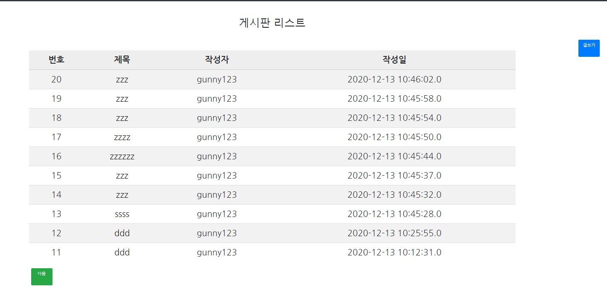

1페이지라서 이전 버튼은 없고 다음 버튼만 있다.

-------------------------------------------------------------------------------------


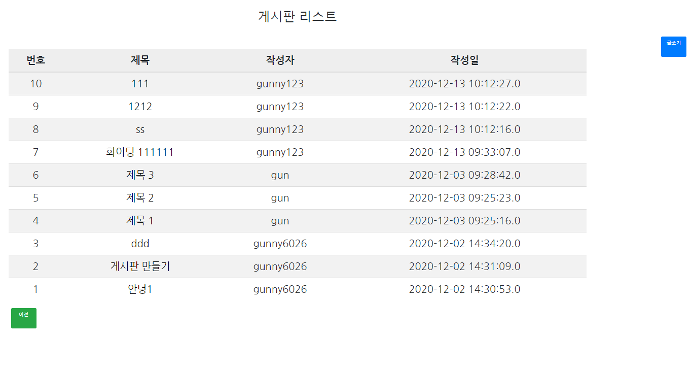

다음 페이지가 더 이상 없기 때문에 다음 버튼은 없고 이전 버튼만 있다.


-------------------------------------------------------------------------------------

## 게시판 글 수정 및 삭제

게시판 글 수정, 삭제는 글 작성자에게만 있는 권한이기 때문에
다른 사용자는 버튼이 보이지 않는다.

```
  <% 
	if(UserId != null && UserId.equals(board.getWriter())){
					
 %>
	<a style="margin: 0px 5px"href="update.jsp?bno=<%= bno %>" class="btn btn-primary">수정</a>
				
	<a style="margin: 0px 5px" onclick="return confirm('정말로 삭제하시겠습니까?')" href="deleteAction.jsp?bno=<%= bno %>" class="btn btn-primary">삭제</a>		
			
<% 
			
	}
			
%>
```


-------------------------------------------------------------------
### 글 삭제 및 수정


게시판 글 수정

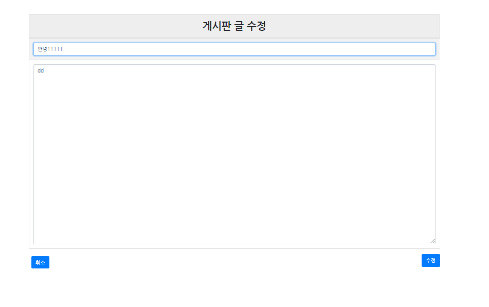

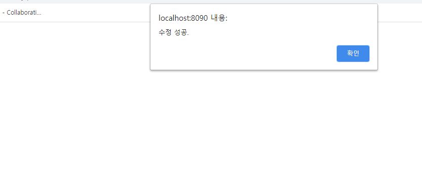


게시판 글 삭제


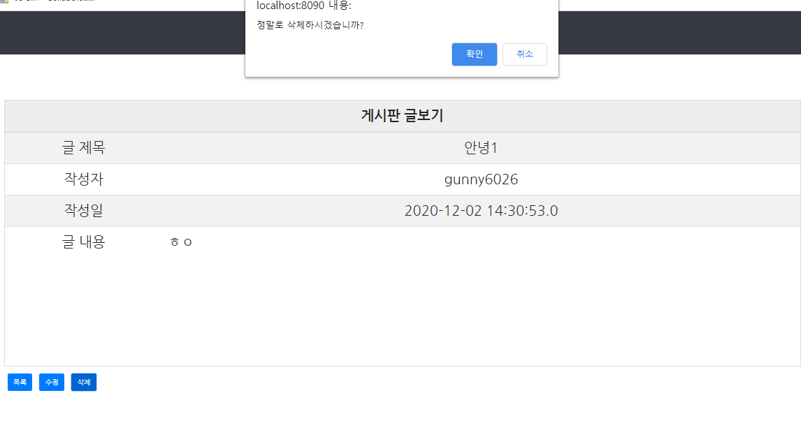

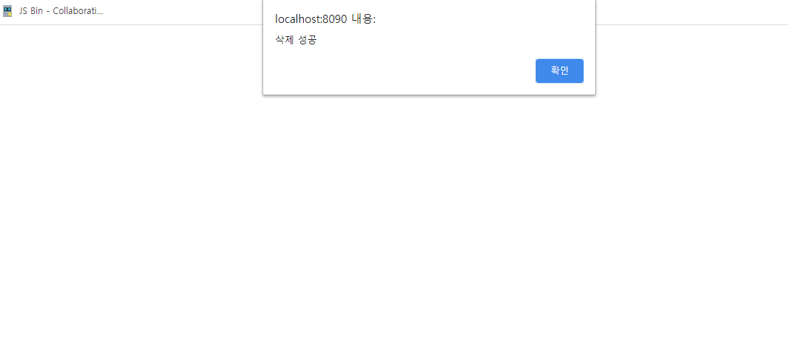


## 회원 수정 및 탈퇴


회원 수정
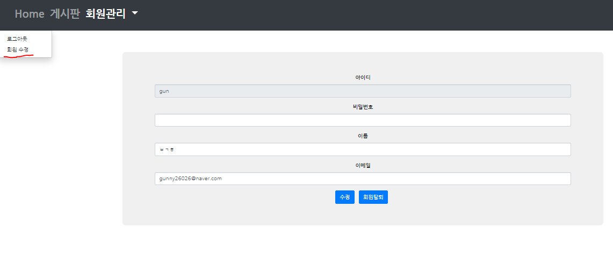

-----------------------------------------------------------------------------------------

회원 탈퇴

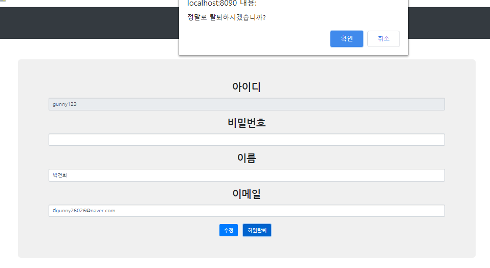

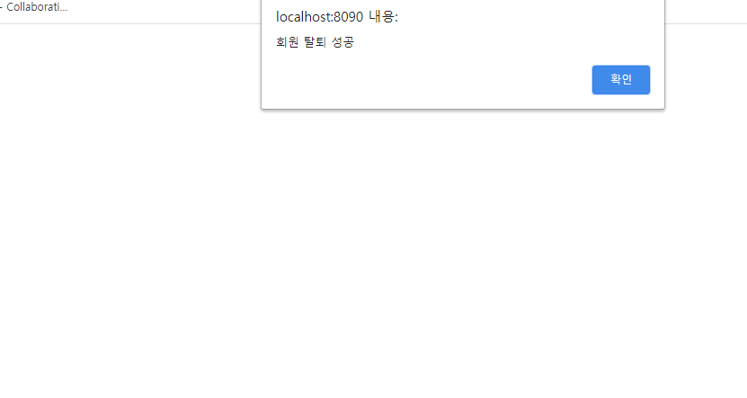


## 회원 탈퇴 시 게시글 데이터 모두 삭제

```
UserDAO dao = new UserDAO();
			//회원 탈퇴
			int result = dao.delete(userID);
			// 회원탈퇴시 게시글 까지 삭제 
			BoardDAO dao2 = new BoardDAO();
			int result2 = dao2.alldelete(userID);
			if(result == -1){
				PrintWriter script = response.getWriter();
				script.println("<script>");
				script.println("alert('탈퇴 실패.')");
				script.println("history.back()");
				script.println("</script>");
			}else{
				if(result2 == -1){
					PrintWriter script = response.getWriter();
					script.println("<script>");
					script.println("alert('게시글 글 삭제 실패')");
					script.println("history.back()");
					script.println("</script>");
				}else{
					PrintWriter script = response.getWriter();
					script.println("<script>");
					script.println("alert('회원 탈퇴 성공')");
					script.println("location.href = 'logout.jsp'");
					script.println("</script>");
				}
				
			}
```

게시글 까지 삭제가 성공해야
탈퇴가 이루어 진다.


```
//회원탈퇴시 게시글 삭제
	public int alldelete(String userID) {
		String sql = "delete from board where writer =?";
		
		try {
			pstmt = conn.prepareStatement(sql);
			pstmt.setString(1, userID);
			return pstmt.executeUpdate();
		}catch(Exception e) {
			
			e.printStackTrace();
		}finally {
			try {
			if(pstmt !=null) pstmt.close();
			if(conn !=null) conn.close();

			}catch(Exception e) {
				e.printStackTrace();
			}
	}
		return -1;
```
로그인 성공 시 사용했던 아이디 값을 세션 값으로 부여하였고

게시글 작성자는 해당 아이디 값으로 설정 했기 때문에
BoardDAO에 있는 게시글 삭제에 있는 매개변수에 해당 세션값 (=아이디)를 넘겨주면 된다.

